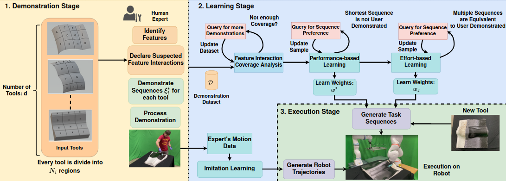

# IRL for Task Sequencing

This repository is the official implementation of [Inverse reinforcement learning framework for transferring task sequencing policies from humans to robots in manufacturing applications](https://sites.google.com/usc.edu/irlfortasksequencing/home/paper). 
This code is intended for reproduction purposes only. Current implementation does not support extensions.
This implementation does not include the human interaction piece mentioned in the paper, however it auto-selects samples based on pre-selected hyperparameters.

</img>

## Requirements

To install requirements, in a conda environment run:

```setup
pip install -r requirements.txt
```

Then in the respository run:
```setup
pip install -e .
```

>The requirements are standard and should work with the latest versions without a specific conda environment

## Dataset and configs
>The datasets are provided in the data folder. The features extracted from the CAD files are stored in the form of csv for the Real (real_data) and the Synthetic dataset (synthetic_data)

>The config folder consists of 3 files. Each of them consists of parameters that can be changed for training
## Training and Evaluations
There are three main files that need to be run in the following order to generate the corresponding results.
Change the current directory to `src` and run the following commands
### Feature Interaction Coverage
```bash
python feature_interaction.py -i feature_interaction_config.json 
```

> The feature interaction config file consists of following parameters:
    > data_type: Can take the values "real" or "synthetic". This chooses the type of data to perform feature interaction analysis
    > testing_molds: This is a list of molds in the corresponding dataset folder (real or synthetic) that should be used for testing
    > plot_data: This is a bool parameter. When set true, this will generate plots and corresponding result files
    > dataset_count: The number of total dataset files to be considered for analysis
    > skewness_threshold: This value is a hyperparameter used to decide the minimum threshold required to ensure uniform distribution of the features. (Refer the paper for further details)

### Performance-based preference learning
```bash
python performance_preference_learning.py -i performance_learner.json 
```
> The performance learner config file consists of parameters similar to the feature interaction config. There is an additional parameter of `max_iterations`. This is the number of times the dataset gets aggregated.

### Effort-based preference learning
```bash
python effort_preference_learning.py -i effort_learner.json 
```
>The effort learner config file consists of parameters similar to the performance learner config. One additional parameter is the "performance_weights", which are retrieved after running the performance-based-preference learner

## Results
After running the files the results will be generated in the current directory

## Reference

```
@INPROCEEDINGS{manyar_icra_2023,
  author={Manyar, Omey M. and McNulty, Zachary and Nikolaidis, Stefanos and Gupta, Satyandra K.},
  booktitle={2023 IEEE International Conference on Robotics and Automation (ICRA)}, 
  title={Inverse Reinforcement Learning Framework for Transferring Task Sequencing Policies from Humans to Robots in Manufacturing Applications}, 
  year={2023},
  volume={},
  number={},
  pages={849-856},
  doi={}}
```
